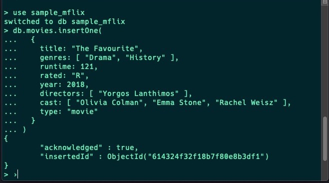

# Backend - Database - Basics - Let's MonGO

## Let's monGO

Add your answers directly into this README file.

1. Explain ObjectIDs in MongoDB; what are they?

> An ObjectId is the default type for "\_id". It use 12 bytes of storage, which gives them a string representation that is 24 hexadecimal digits: 2 digits for each byte. This causes them to appear larger than they are, the string is actually twice as long as the data being stored.
>
> -   The 12 bytes of an ObjectId are generated as Timestamp, Random and Counter (random start value).
> -   The first four bytes of an ObjectId are a timestamp in seconds since the epoch. This provides a couple of useful properties.
> -   The next five bytes of an ObjectId are a random value.
> -   The final three bytes are a counter that starts with a random value to avoid generating colliding ObjectIds on different machines.
> -   These first nine bytes of an ObjectId guarantee its uniqueness across machines.
> -   The last three bytes are simply an incrementing counter.

2. You have a collection called "users" with a document like this: `{ _id: 1, name: "Veera" }`. What query would you use to update the name to "Princess Veera Silkenfur"?

```sql
  > db.users.updateOne({ _id: 1, name: "Veera" },
    ... {$set : {name: "Princess Veera Silkenfur"}})
```

3. How do you make a collection?

```sql
  > db.createCollection('users')
```

4. So the (old) mongo shell is kind of like a JavaScript REPL. What is a REPL? Which other REPL have we used?
    > REPL(read-eval-print-loop) is command-line tool, used for processing Node.js expressions. It capture JavaScript code inputs, interprets, and evaluates the result of the code.
    > In lemon terms repl is when you type `node` and press [enter] in the terminal.
5. So the (old) mongo shell is kind of like a JavaScript REPL. You can use things like variables, try...catch statements and loops. Experiment with it and find at least three other JavaScript things that we have used that work in the (old) shell. If you can, try to find even more!

```sql
  > function factorial (n) {
    ... if (n <= 1) return 1
    ... return n * factorial(n - 1)
    ... }
    [Function: factorial]
  > factorial(5)
  120
```

```sql
  > new Date("20109/1/1")
  ISODate("+020108-12-31T23:00:00.000Z")
```

```sql
  > "Hello, World!".replace("World", "Mongo")
  Hello, Mongo!
```

6. (Research) So the old shell is pretty cool. How is the new shell better?

> Sofar, Mongosh is cooler!!. The prompt actually shows the db you are in we therefore, don't have to type `db` to check. Also has syntax highlighting which is looks cooler.




7. (Research) How can you insert multiple documents at the same time?

```sql
> db.movies.insertMany([
...   {
.....     title: 'Docteur?',
.....     Director: 'Tristan Séguéla',
.....     genre: 'Comedy',
.....   },
...   {
.....     title: 'Moonbound',
.....     Director: 'Ali Samadi Ahadi',
.....     genre: 'Animation',
.....   },
...   {
.....     title: 'Hunters',
.....     Director: 'Justin Lee',
.....     genre: 'Action',
.....   }
... ])
```

8. (Research) You have a collection called `cats` with a documents like this: `{ name: "Veera" }, { name: "Rauli" }, { name: "BenBen" }` - How can you insert the field `cute: true` into all of them with one command?

```sql
  > db.cats.updateMany({}, {$set : {"cute" : true}})
```

9. (Task) Start a timer for 30 minutes. Spend all that time getting to know and reading https://docs.mongodb.com/manual/introduction/ - how far did you get? What was the most cool or interesting thing you learned?

## Cool stuff!

```sql
  > help # 'Database-level' help
  > db.movies.updateOne # prints the JS source code for the fn.
  # notice updateOne is without parenthesis.
```

```zsh
  $ mongo script1.js script2.js script3.js # will execute each script listed and exit.
```

```js
    // valid JavaScript equivalents:
    use video           db.getSisterDB('video')
    show dbs            db.getMongo().getDBs()
    show collections    db.getCollectionNames()
```

10. Find one SQL Cheatsheet and one MongoDB Cheatsheet and add links to them here.

-   [SQL Cheat sheet](https://learnsql.com/blog/sql-basics-cheat-sheet/)
-   [MongoDB Cheat sheet](https://www.mongodb.com/developer/quickstart/cheat-sheet/)

🌿
